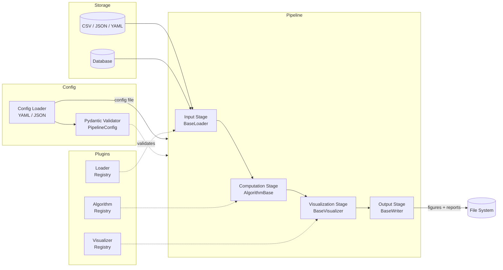

# Architecture Documentation

> **experiment-engine** — Modular Algorithm Experimentation Framework

## Data Flow Diagram

The pipeline follows a strict linear flow with typed boundaries between each stage:



## Pipeline Stages

### 1. Input Stage (`src/experiment_engine/io/`)

Loads data from a source and converts it into a standard internal format.

| Loader        | Format     | Description                |
|---------------|------------|----------------------------|
| `CsvLoader`   | CSV        | Tabular data via NumPy     |
| `JsonLoader`  | JSON       | Structured data            |
| `YamlLoader`  | YAML       | Config-like data           |
| (custom)      | any        | Plugin-registered loaders  |

**Output:** A `pandas.DataFrame` or equivalent NumPy array (typed via Pydantic model).

### 2. Computation Stage (`src/experiment_engine/core/`)

Runs a registered algorithm against the loaded data.

- Algorithms are discovered through the plugin registry
- Each algorithm receives data + params and returns typed results
- Built-in algorithms: linear regression, k-means (planned)

**Input:** Data + `AlgorithmConfig`
**Output:** `dict[str, Any]` of results + metrics

### 3. Visualization Stage (`src/experiment_engine/viz/`)

Renders results using one or more backends.

| Visualizer     | Backend    | Output Format   |
|----------------|------------|-----------------|
| `MatplotlibViz`| Matplotlib | PNG, PDF, SVG   |
| `PlotlyViz`    | Plotly     | Interactive HTML|
| (custom)       | any        | Plugin-registered |

**Input:** Results dict
**Output:** List of figure file paths

### 4. Output Stage

Writes all artifacts (figures, metrics JSON, log) to the output directory. The output structure:

```
results/
├── experiment-name/
│   ├── config.yaml          # Snapshot of the config used
│   ├── metrics.json         # Computed metrics
│   ├── figures/
│   │   ├── scatter.png      # Matplotlib output
│   │   └── scatter.html     # Plotly output
│   └── pipeline.log         # Execution log
```

## Module Map

```
src/experiment_engine/
├── __init__.py        # Package version & public API exports
├── __main__.py        # `python -m experiment_engine` entry
├── cli.py             # Click-based CLI (run, validate, list-plugins)
├── core/
│   └── __init__.py    # Pipeline orchestrator, step executors
├── io/
│   └── __init__.py    # BaseLoader, BaseWriter, format adapters
├── viz/
│   └── __init__.py    # BaseVisualizer, backend implementations
├── plugins/
│   └── __init__.py    # PluginRegistry, AlgorithmBase, decorators
├── models/
│   └── __init__.py    # Pydantic config schemas & result models
└── config/
    └── __init__.py    # Config loader (YAML/JSON → PipelineConfig)
```

## Plugin Discovery

Plugins are discovered via three mechanisms (in order of priority):

1. **Entry points** — `experiment_engine.algorithms`, `experiment_engine.loaders`, `experiment_engine.visualizers` in `pyproject.toml`
2. **Runtime registration** — Using `@register_algorithm("name")` or `registry.register_algorithm("name", MyClass)`
3. **Directory scanning** — (future) Auto-discover plugins from `~/.experiment-engine/plugins/`

## Key Design Decisions

- **Pydantic at every boundary** — Configuration, pipeline stage inputs/outputs, and results are all validated via Pydantic models for type safety.
- **Click-based CLI** — Clean, composable command-line interface with auto-generated help.
- **Rich console output** — Progress bars, colored tables, structured logging.
- **Plugin-first** — The registry is the single source of truth for discovering algorithms/loaders/visualizers. No hard-coded imports.
- **Separation of concerns** — Each pipeline stage lives in its own subpackage with a minimal public API (`BaseLoader`, `AlgorithmBase`, `BaseVisualizer`).
